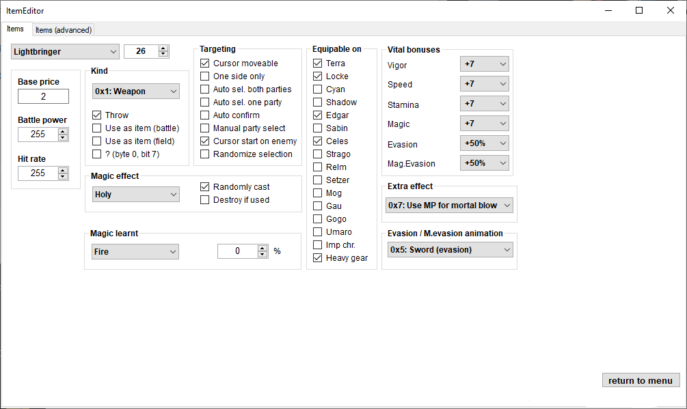

# FF6AE

## Presentation

FF6AE is an multi-editor for Final Fantasy Advance VI (USA) on GBA. It's a C#/WinForms utility with a UI heavily inspired by [FF3usME](https://www.romhacking.net/utilities/86/), which is a similar editor but for the SNES/Super Famicom releases (respectively FF3us and FF6j). FF6AE was my first programming project outside school (first half of 2013), so the coding style here does not reflect my coding style of 2022 and how I would make things now.

FF6AE consist of five sub-editors, one for monster data, on for item data, one for spell data, one for actors data and finally an editor for the small and big fonts. You can download the last compiled binary ([v3.1.1](https://github.com/fred65816/FF6AE/releases/tag/3.1.1)) in the release section. If you want to edit FF6A with a more complete and web-based tool, I suggest looking into [FF6Tools](https://everything8215.github.io/ff6tools/ff6tools.html).

## Screenshots

### Main menu

### Monster data editor

### Item data editor

### Spell data editor

### Actor data editor

### Font editor

